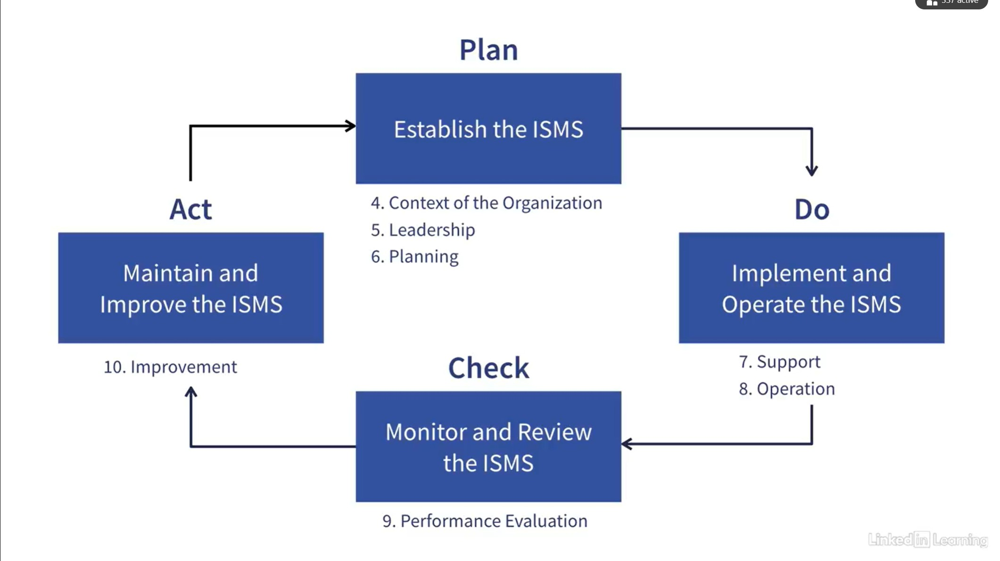

# LinkedIn-ISO-27001
ISO 27001:2022-Compliant Cybersecurity: Getting Started
- <figure>  </figure>
- <figure>  </figure>
Nonconformities
Years, 2 and 3 you only need 3rd party surveillance reviews 
## Caluse 4
- Clause 4.1 – Understanding the Organization and Its Context
- Clause 4.2 – Understanding the Needs and Expectations of Interested Parties
- Clause 4.3 – Determining the Scope of the ISMS
- Clause 4.4 – Information Security Management System
## Caluse 5
- Clause 5.1 Leadership and Commitment 
- Clause 5.2 Policy -- Create IS Policy and show it's communicated and available to the organization and interested parties.
- Clause 5.3 Organizational Roles, Responsibilities, and Authorities -- Build R&Rs matrix -- show the responsibility for ISO 27001 compliance is assigned to a person or group.-- communicate organizational R&Rs
