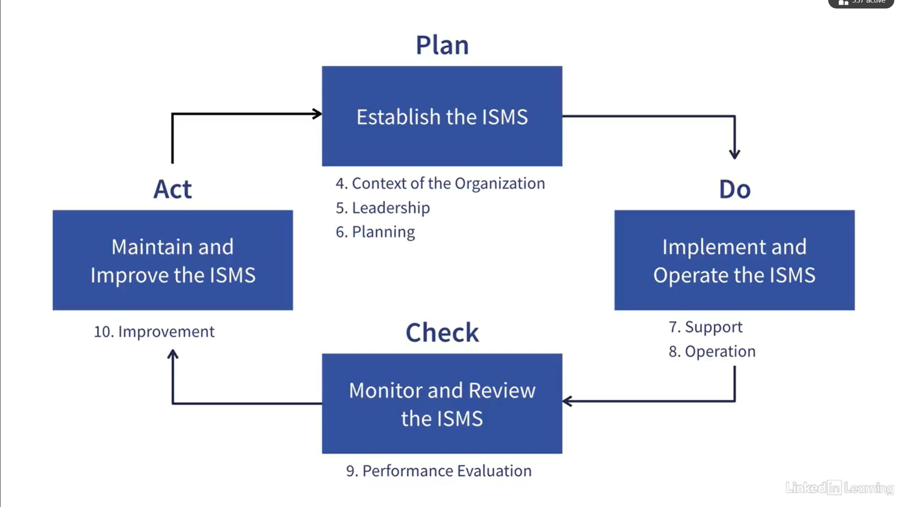

# LinkedIn-ISO-27001
ISO 27001:2022-Compliant Cybersecurity: Getting Started
- <figure>  </figure>
- <figure>  </figure>
Nonconformities
Years, 2 and 3 you only need 3rd party surveillance reviews 
## Caluse 4
- 4.1 Understanding the Organization and Its Context
- 4.2 Understanding the Needs and Expectations of Interested Parties
- 4.3 Determining the Scope of the ISMS
- 4.4 Information Security Management System
## Caluse 5
- 5.1 Leadership and Commitment 
- 5.2 Policy -- Create IS Policy and show it's communicated and available to the organization and interested parties.
- 5.3 Organizational Roles, Responsibilities, and Authorities -- Build R&Rs matrix -- show the responsibility for ISO 27001 compliance is assigned to a person or group.-- communicate organizational R&Rs
## Caluse 6
- 6.1 Actions to Address Risks and Opportunities
  - 6.1.1 General – Consider context and interested parties.
  - 6.1.2 Risk Assessment – Establish and maintain a process for assessing information security risks.
  - 6.1.3 Risk Treatment – Define how risks will be treated and create a Risk Treatment Plan and Statement of Applicability (SoA).
- 6.2 Information Security Objectives and Planning to Achieve Them
## Clause 7
- 7.1 Resources
  - Provide the right resources for your ISMS
- 7.2 Competence
  - of people based on education, training or experience.
  - Records include evidence of education, training and experience 
  - Recruit competent personnel, provide access to education and encourage people to self-study
- 7.3 Awareness
  - Everyone must be aware of the information security policy, their contribution to the IS policy and the implications of not conforming to IS reqs
  - Create Acceptable Use Policy that everyone must read and agree to follow
- 7.4 Communication
  - Determine communication needs (what, when, who, why, ....)
- 7.5 Documented Information
  - check teh doc including all the mandatory docs for ISO Mandatory and non-mandatory documents and records for ISO 27001.pdf
  - Write document control procedures (Availability and suitability for use, Protection, Storage and preservation, Version control,....)
## Clause 8
- 8.1 Operational planning and control
  - Implement clause 6.
  - Keep process documentation.
  - Have a change management process.
  - Identify and control outsources processes
- 8.2 Information Security Risk Assessment
  - Conduct risk assessment
  - Document the results of your risk assessment
- 8.3 Information Security Risk Treatment
  - Implement risk treatment plan.
  - Document the results of risk treatment.
## Clause 9
- 9.1 Monitoring, Measurement, Analysis and Evanluation
  - What needs to be measured?
  - Which methods will be used?
  - When the measuring will be performed?
  - Who will do the measuring and monitoring?
  - Who will do the anlysis and evaluation of the results?
- How to demonstrate compliance?
  - Document how the organization does the Monitoring, Measurement, Analysis and Evanluation related to it ISMS
  - Document how the organization used the results to improve ISMS
- 9.2 Internal Audit
  - Plan, establish, implement and maintain an audit program
  - Define the audit criteria
  - Select auditors and conduct audits that are objective and impartial
  - Report the results of audits to relevant management and retain documents of the audit results.
- Audit program required specifications
  - How frequently audits are conducted
  - Methods used to condut audits
  - Responsibilties related to audits
  - Audit planning requirements.
  - Reporting requirements 
  - Be Objective no self-audit are allowed
- How to demonstrate compliance?
  - Establish and implement an audit program
  - Select impartial and objective aauditors
  - Document your internal audit program.
- 9.3 Management review
  - Status of nonconformities and corrective actions.
  - Results from the measurements of the effectiveness of security controls.
  - Results of ISMS audits and reviews.
  - Fulfillment of information security objectives.
- How to demonstrate compliance?
  - Schedule and conduct regular management reviews of the ISMS in acordance with the requirements of this clasue.
  - Create documented evidence
- 10.1 Nonconformity and corrective action
  - Nonconformity failure to implement and maintain one or more ISMS requirements. Doubt that your ISMS can meet the information security policy and security objectives
- 10.2 Continual Improvement
- How to demonstrate compliance?
  - Define and implement a method for addressing nonconformities.
  - Document any found nonconformities.
  - Document the corrective actions

